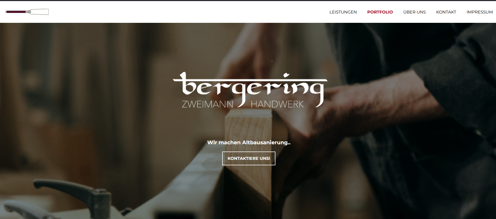
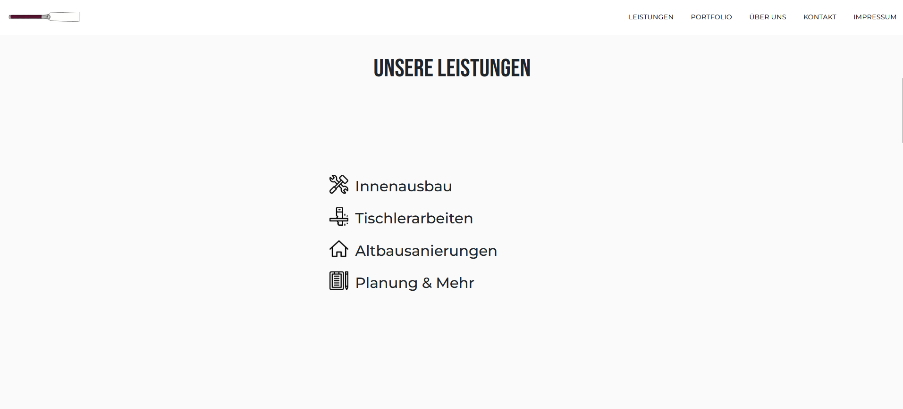
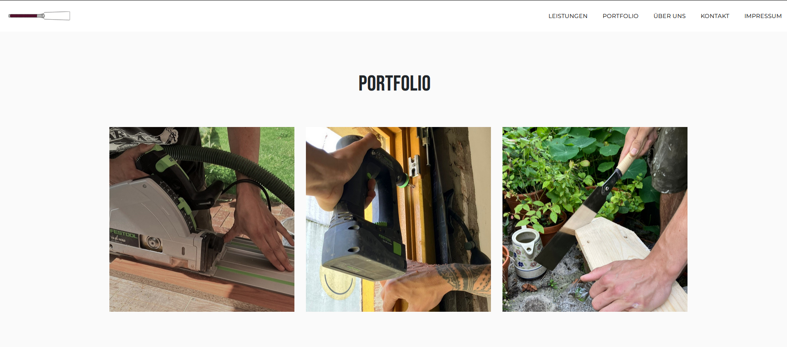
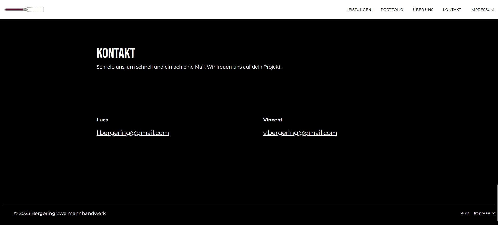

This is a static website designed and developed for the independent craftsmen of Zweimann Handwerk.
The project was created with Boostrap.

## Tech Stack
- Boostrap
- HTML / CSS

## Installation

Clone the repository:
'git clone https://github.com/claras000/bergering.github.io'

Navigate to the project directory:
'cd your-repo'

Install Node.js dependencies:
'npm install'

This command will install the necessary packages and libraries listed in the package.json file.

## Dependencies
List any major dependencies along with their versions. For example:
- Node.js: ^14.0.0
- Bootstrap: ^5.0.0

## Author
Clara Osterburg Correa (Design & Implementation)

## Click here for the website
https://bergering.de/
